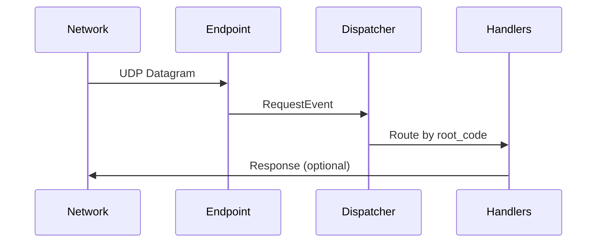

# Requests Module Documentation

## Overview

The `requests.py` module forms the core network request handling system for PeerConnect. It manages:

- Network endpoint initialization
- UDP multicast/broadcast communication
- Request dispatching
- Integration with Kademlia DHT ([more](https://github.com/ShaikAli65/PeerConnect/blob/dev/docs/core/kademlia.md)) and gossip protocols [more](https://github.com/ShaikAli65/PeerConnect/blob/dev/docs/core/gossip.md).
- Discovery protocol implementation [more](https://github.com/ShaikAli65/PeerConnect/blob/dev/docs/discovery.md).

## Key Components

### 1. Core Classes

#### `RequestsDispatcher`
```python
class RequestsDispatcher(QueueMixIn, ReplyRegistryMixIn, BaseDispatcher)
```
- **Responsibilities**:
  - Queue-based request processing
  - Handler registry management
  - Event dispatching
- **Key Features**:
  - Mixin-based architecture for flexibility
  - Async-compatible queue system
  - Automatic exception handling

#### `RequestsEndPoint`
```python
class RequestsEndPoint(asyncio.DatagramProtocol)
```
- **Protocol Handler**:
  - UDP datagram reception
  - Packet validation
  - Event creation
- **Characteristics**:
  - Low-level socket operations
  - Integration with asyncio's DatagramProtocol
  - Error-resilient packet processing

### 2. Initialization Process

#### `initiate()`
Main initialization sequence:
```python
async def initiate():
    # Network setup
    req_dispatcher = RequestsDispatcher(...)
    transport = await setup_endpoint(...)
    
    # Protocol integration
    kad_server = _kademlia.prepare_kad_server(...)
    gossip_dispatcher = gossip.initiate_gossip(...)
    
    # State management
    discovery_state = State("discovery", ...)
    add_to_lists = State("adding peers", ...)
    
    # System registration
    Dock.dispatchers[DISPATCHS.REQUESTS] = req_dispatcher
    Dock.requests_endpoint = transport
```

### 3. Network Configuration

#### Socket Setup
```python
async def _create_listen_socket(bind_address, multicast_addr):
    # Creates configured UDP socket with:
    # - Multicast support (v4/v6)
    # - Broadcast capability
    # - Platform-specific optimizations
```

#### Endpoint Creation
```python
async def setup_endpoint(bind_address, multicast_address, req_dispatcher):
    # Creates datagram endpoint with:
    # - Custom protocol handler
    # - Multicast group membership
    # - Async I/O integration
```

## Protocol Handling

### Packet Processing Flow


### Key Protocol Features

1. **Multicast Support**:
   - IPv4: `socket.IP_ADD_MEMBERSHIP`
   - IPv6: `socket.IPV6_JOIN_GROUP`
   - Platform-specific optimizations

2. **Discovery Protocol**:
   - Multicast-based peer discovery
   - Kademlia DHT integration
   - State-managed initialization

3. **Error Handling**:
   - Structured exception logging
   - Invalid packet detection
   - Transport-layer error resilience

## Usage Patterns

### Sending Requests
```python
# Create request event
event = RequestEvent(
    root_code=b'\x01',
    request=WireData(...),
    from_addr=('192.168.1.10', 54321)
)

# Submit to dispatcher
await Dock.dispatchers[DISPATCHS.REQUESTS].submit(event)
```

### Receiving Requests
```python
class CustomHandler:
    def __init__(self):
        Dock.dispatchers[DISPATCHS.REQUESTS].register(b'\x02', self.handle)
    
    async def handle(self, event):
        # Process RequestEvent
        response = process(event.request)
        await send_response(response, event.from_addr)
```

## Performance Considerations

1. **Queue Management**:
   - Async-compatible queue system
   - Priority-based processing
   - Batch handling capabilities

2. **Socket Optimization**:
   - Reuse address/port configurations
   - Platform-specific socket options
   - Zero-copy receive buffers

3. **Concurrency**:
   - Asyncio-native implementation
   - Non-blocking I/O
   - Worker pool integration

## Security Aspects

1. **Validation**:
   - Strict packet structure checks
   - Protocol version verification
   - Source address validation

2. **DDoS Protection**:
   - Rate limiting
   - Request prioritization
   - Resource quota enforcement

3. **Privacy**:
   - Optional payload encryption
   - Anonymized peer identifiers
   - Secure discovery mechanisms

## Dependencies

| Dependency | Purpose |
|------------|---------|
| `asyncio` | Async I/O framework |
| `logging` | Diagnostic logging |
| `socket` | Low-level networking |
| `kademlia` | DHT implementation |
| `gossip` | Epidemic protocol |

## Notes

1. **Platform Considerations**:
   - Windows requires special binding configuration
   - Linux needs multicast route setup
   - BSD variants require socket option adjustments

2. **Discovery Protocol**:
   ```python
   discovery_state = State(
       "discovery",
       functools.partial(
           discovery_initiate,
           kad_server,
           multicast_address,
           req_dispatcher,
           transport
       ),
       is_blocking=True,
   )
   ```
   - Uses multicast for initial peer discovery
   - Falls back to broadcast in LAN environments (TBD).
   - Integrates with Kademlia for peer persistence

3. **Shutdown Sequence**:
   ```python
   async def end_requests():
       Dock.kademlia_network_server.stop()
       Dock.requests_endpoint.close()
   ```
   - Graceful transport termination
   - Resource cleanup
   - State preservation (WIP)
